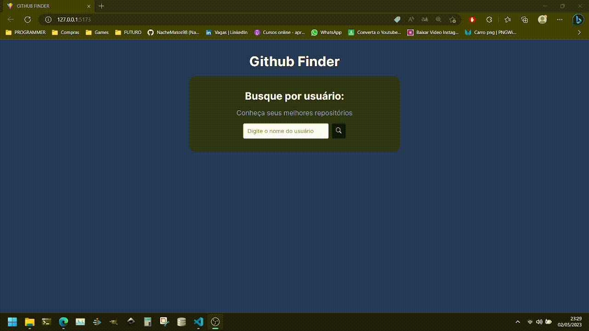

# Projeto - GitHub Finder

O projeto consiste em uma aplicação que ao pesquisar por um perfil, returna algumas informações sobre esse perfil do GitHub, como numero de seguidores, foto etc
feito com REACT.JS e a API do GitHub.

- O projeto

 

- Demonstração

 

## 💻 Tecnologias utilizadas
As seguintes ferramentas foram utilizadas na construção do projeto:
- [Javascript](https://developer.mozilla.org/en-US/docs/Web/JavaScript) | [HTML](https://developer.mozilla.org/en-US/docs/Web/HTML) | [CSS](https://developer.mozilla.org/en-US/docs/Web/CSS)
- [React.js](https://developer.mozilla.org/en-US/docs/Web/React)
